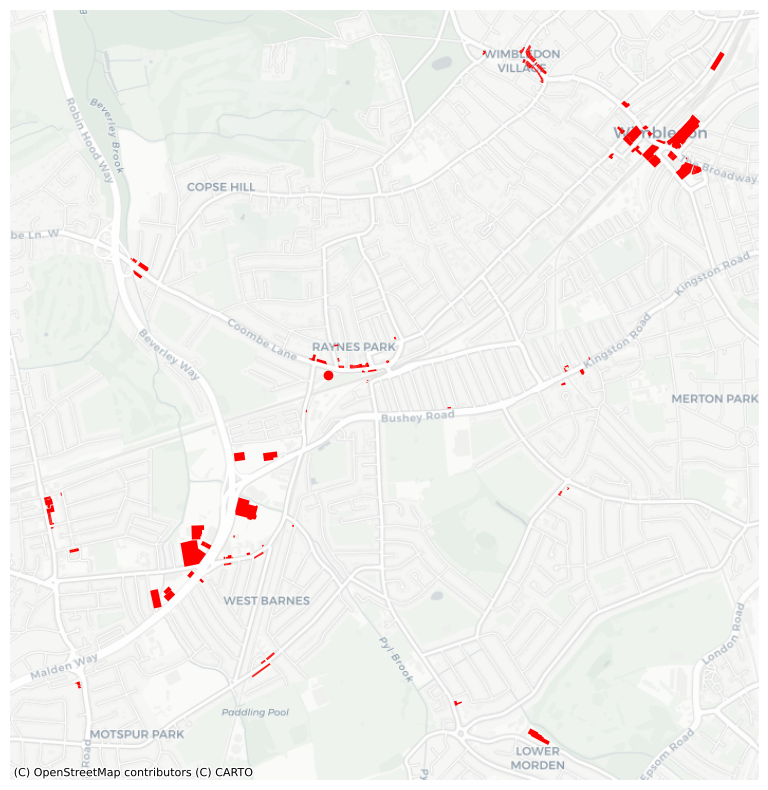
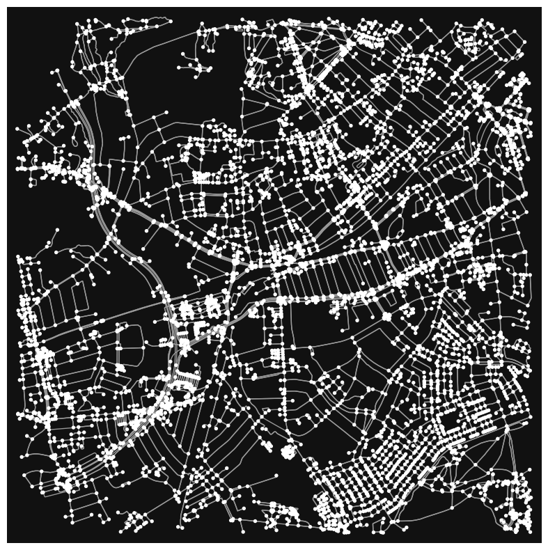
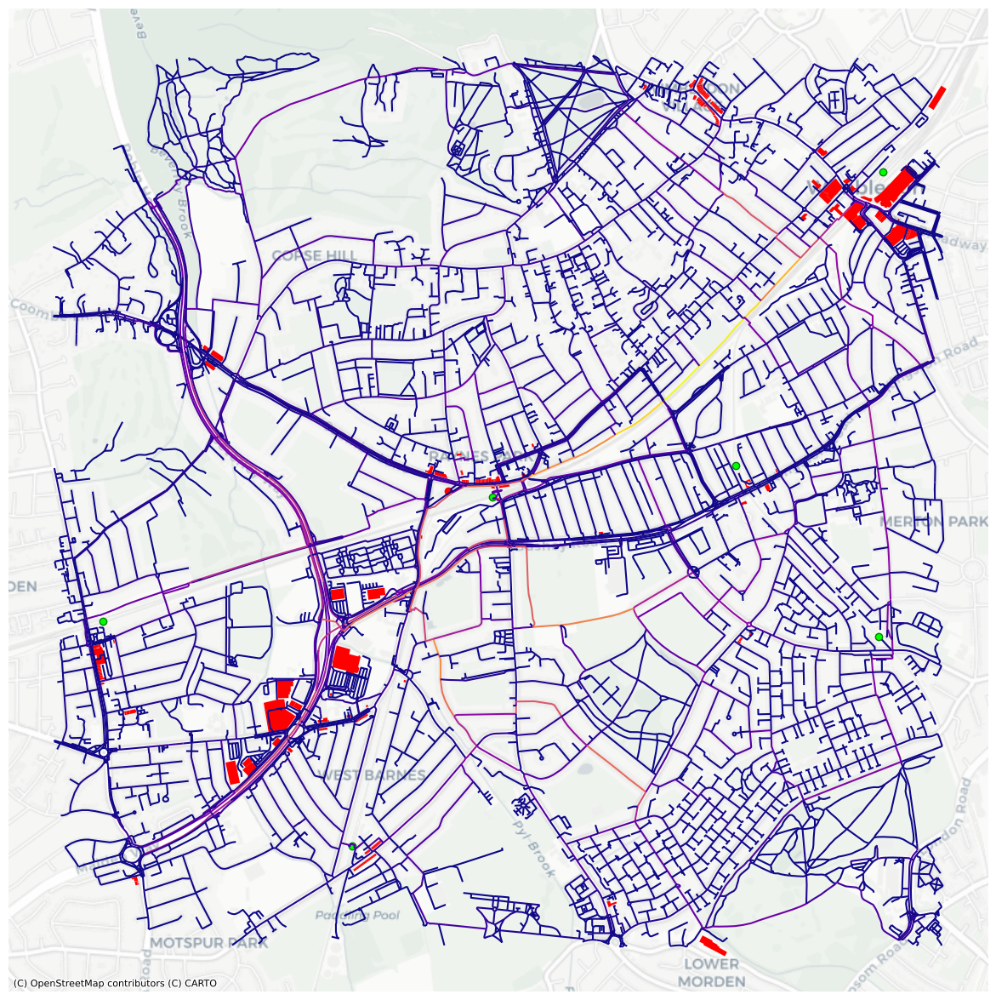

# Betweeness centrality and retail opportunity locations in Raynes Park, London

## 1: Introduction

Raynes Park is a quiet suburban neighborhood in South West London, with good conections to neighboring areas like Wimbledon and central London via railway. The analysis will asses whether proximity to a railway station or the network betweeness centrality is more important in determining the location of retail opportunities in the 2,000m area around Raynes Park Sation.

There are five other railway stations within the study area: Wimbledon mainline station to the North East, New Malden to the West, Motspur Park to the South, and Wimbledon Chase and South Merton to the East. Another significant transportation link in the study area is the A3 running from north to south along the western side of the study area. 


```python
# imports the libraries needed
import numpy as np
import pandas as pd
import matplotlib
import matplotlib.pyplot as plt
import osmnx as ox 
import networkx as nx 
import matplotlib.cm as cm
import matplotlib.colors as colors
import contextily as ctx
```

#### Figure 1: retail opportunities in the study area


```python
# use building and shop value/key pairs to identify local reail opportunities 
tags= tags={'building':['commercial', 'retail'],'shop':['food','doityourself','convenience','supermarket', 'mall']}
building_geom=ox.features.features_from_address('Raynes Park Station, London', tags, dist=2000)
building_geom = building_geom.to_crs(epsg=3857)

# drop any duplicate building footprints
building_geom=building_geom.drop_duplicates(subset=['geometry'])

# plot all the retail buildings w/i 2000m of Raynes Park
ax = building_geom[building_geom['building'].notna()].plot(figsize=(10,10),color='red')
ctx.add_basemap(ax,source=ctx.providers.CartoDB.Positron)
plt.axis('off')

plt.show()
```


    

    


#### Figure 2: basic graph of study area


```python
G=ox.graph_from_address('Raynes Park Station, London', dist=2000)
```


```python
ox.plot_graph(G, figsize=(10,10))
fig.savefig('RP_basic_network.png')
```


    

    


## 2: Analysis and Visualization

Betweenness centrality is a measure of the frequency with which a given node or edge in a graph makes up part of a shortest path between points in the network (Newman, 2010). Betweenness centrality can be interpreted as an indicator of the importance of the nodes and edges within the graph as well as the level of traffic flows they will see.


```python
# set multiGraph to diGraph for analysis
DG = ox.get_digraph(G)
```


```python
# get geometries of train stations in the area
tags1= tags={'public_transport':['station'],}
stations=ox.features.features_from_address('Raynes Park Station, London', tags1, dist=2000)
stations = stations.to_crs(epsg=3857)
```

#### Figure 3: betweenness centrality and retail opportunities in Raynes Park study area


```python
# calculate betweeness centrality:
edge_bc = nx.betweenness_centrality(nx.line_graph(DG))
nx.set_edge_attributes(DG, edge_bc,'bc')
G = nx.MultiGraph(DG)

# convert graph to geopandas dataframe
gdf_edges = ox.graph_to_gdfs(G,nodes=False,fill_edge_geometry=True)

# set crs to 3857 (needed for contextily)
gdf_edges = gdf_edges.to_crs(epsg=3857) # setting crs to 3857

# plot edges according to degree centrality
ax=gdf_edges.plot('bc',cmap='plasma',figsize=(15,15))

# add a basemap using contextilly
import contextily as ctx
ctx.add_basemap(ax,source=ctx.providers.CartoDB.Positron)
building_geom[building_geom['building'].notna()].plot(figsize=(15,15),color='red', ax=ax)
stations[stations['public_transport'].notna()].plot(figsize=(15,15),color='lime', edgecolor='green', ax=ax)
plt.axis('off')
plt.show()
```


    

    


```python
# static image version in case running the above code takes too long
RP_bc_retail_vF.png
```

## 3: Discussion

Access via rail and car appears to be more important in determining retail location in Raynes Park than overall network betweenness centrality. 
The highest betweenness centrality values are along a pedestrian path between Raynes Park and Wimbledon station which offers no retail opportunities.

 Despite these areas having lower betweenness centrality value,s clusters of retail locations can be visually identified near Raynes Park, New Malden, Wimbledon Chase, and Wimbledon stations, as well as a significant cluster of big box stores (ie. Tesco Extra, B&Q) around the A3 junction. 


#### Sources
Newman, M.E.J. 2010. Networks: An Introduction. Oxford, UK: Oxford University Press.

